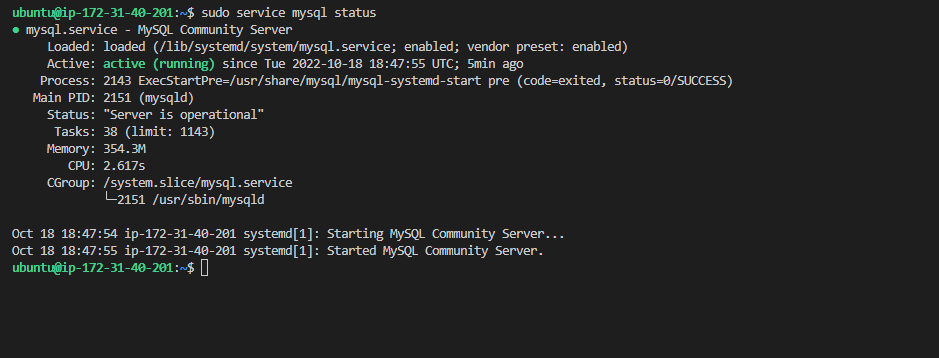

#   LAMP STACK IMPLEMENTATION

##  INSTALLING APACHE2

`sudo apt update`

`sudo apt install apache2`

`sudo systemctl status apache2`

open TCP to port 80 on AWS console

`curl http://localhost:80`

[testing apache http server](http://35.181.26.164/)

`curl -s http://35.181.26.164/latest/meta-data/public-ipv4`

### MYSQL installation

`sudo apt update`

`sudo apt upgrade`

`sudo apt install msql-server`

`sudo service mysql status`

`sudo mysql`

set password for root user

`ALTER USER 'root'@'localhost' IDENTIFIED WITH mysql_native_password BY 'PassWord.1';`

start interactive script

`sudo msql_secure_installation`

`sudo mysql -p`

 INSTALLING PHP

`sudo apt install php libapache2-mod-php php-mysql`

`php -v`

CREATING A VIRTUAL HOST FOR YOUR WEBSITE USING APACHE

`sudo mkdir /var/www/projectlamp`

`sudo chown -R $USER:$USER /var/www/projectlamp`

`sudo vi /etc/apache2/sites-available/projectlamp.conf`

`<VirtualHost *:80>
    ServerName projectlamp
    ServerAlias www.projectlamp
    ServerAdmin webmaster@localhost
    DocumentRoot /var/www/projectlamp
    ErrorLog ${APACHE_LOG_DIR}/error.log
    CustomLog ${APACHE_LOG_DIR}/access.log combined
</VirtualHost>`

`sudo ls /etc/apache2/sites-available`

`sudo a2ensite projectlamp`

`sudo a2dissite 000-default`

`sudo apache2ctl configtest`

`sudo systemctl reload apache2`

`sudo echo 'Hello LAMP from hostname' $(curl -s http://15.188.53.3/latest/meta-data/public-hostname) 'with public IP' $(curl-s http://15.188.53.3/latest/meta-data/public-ipv4) > /var/www/projectlamp/index.html`

[public ip address](http://15.188.53.3/)

[public dns](http://ec2-15-188-53-3.eu-west-3.compute.amazonaws.com/)

ENEABLING PHP ON WEBSITE

sudo vim /etc/apache2/mods-enabled/dir.conf

`<IfModule mod_dir.c>
        #Change this:
        #DirectoryIndex index.html index.cgi index.pl index.php index.xhtml index.htm
        #To this:
        DirectoryIndex index.php index.html index.cgi index.pl index.xhtml index.htm
</IfModule>`

 

`sudo systemctl reload apache2`

vim /var/www/projectlamp/index.php
        
`<?php
phpinfo();`

`sudo rm /var/www/projectlamp/index.php`

